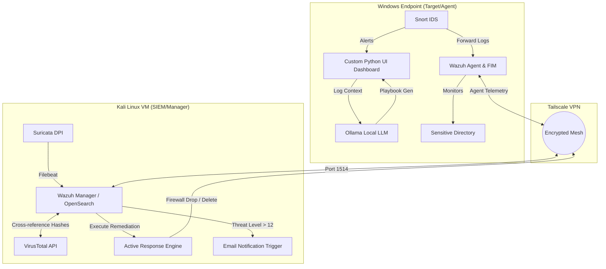
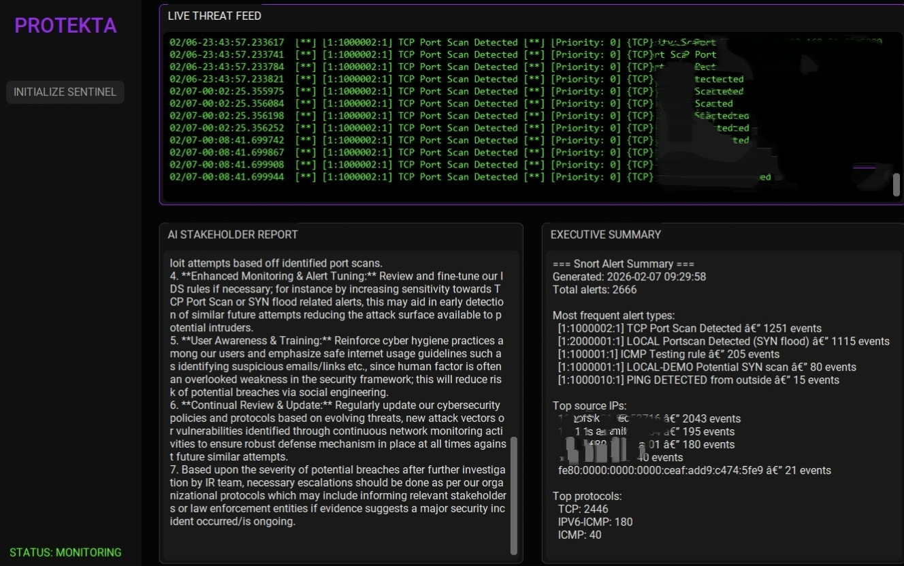
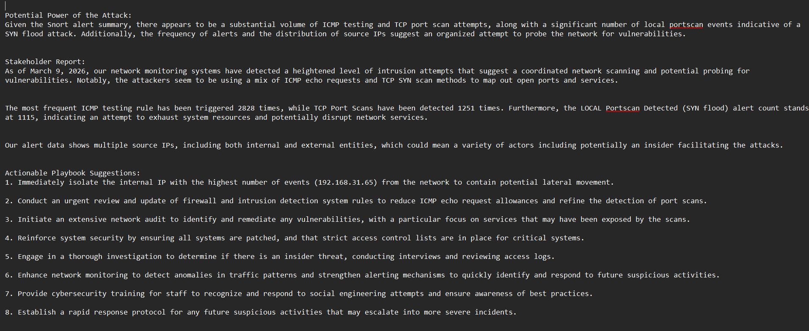
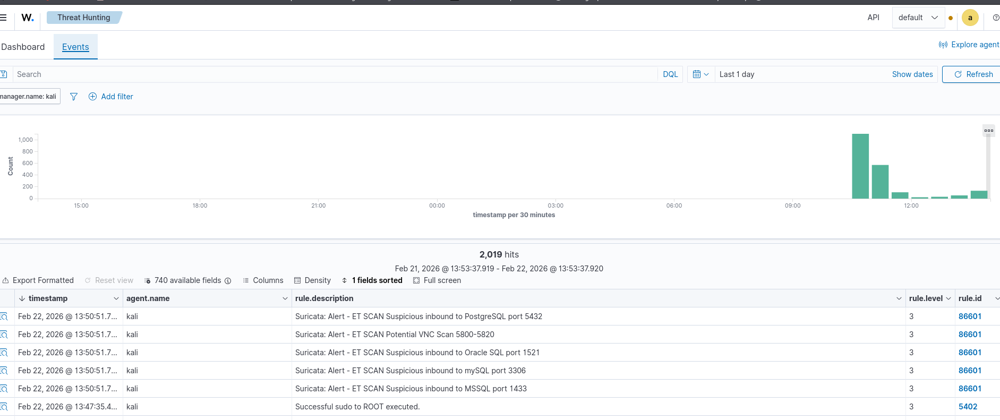
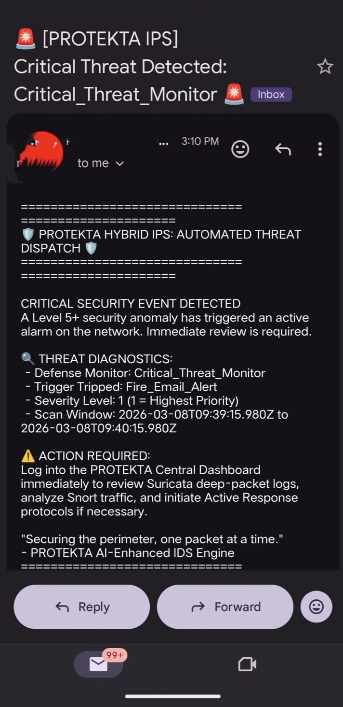

# PROTEKTA: AI-Enhanced Hybrid IDS/IPS System

PROTEKTA is a comprehensive, hybrid Intrusion Detection and Prevention System (IDS/IPS) that bridges network telemetry, endpoint security, and local AI-driven analysis. Engineered to not only detect threats but actively mitigate them, it executes instant firewall reconfigurations, malware deletion, and automated, executive-ready incident reporting—all within a secure, cross-platform environment.

## 🚀 System Architecture & Capabilities

The infrastructure is securely bridged across a Kali Linux virtual machine and a Windows endpoint using a **Tailscale VPN** tunnel.



### 🛡️ Detection & Endpoint Security
* **[Wazuh](https://wazuh.com) Manager (Kali VM):** Centralized SIEM indexing logs, managing alerts, and orchestrating active responses.
* **Wazuh Agent (Windows):** Enforces strict File Integrity Monitoring (FIM) over designated target folders.
* **[Suricata](https://suricata.io) (Kali VM):** Performs deep packet inspection, with logs parsed and forwarded via **[Filebeat](https://www.elastic.co/beats/filebeat)**.
* **[Snort](https://www.snort.org) (Windows):** Localized network testing paired with a custom rule-based parsing script.

### ⚔️ Active Mitigation & Threat Intel (IPS)
* **Automated Firewall & IPS:** Wazuh dynamically updates firewall tables to drop malicious packets and block source IPs.
* **Malware Remediation:** Integrates **[VirusTotal API](https://www.virustotal.com)** to instantly detect and delete altered malicious file hashes.
* **Critical Incident Alerting:** High-severity anomalies automatically trigger direct **Gmail notifications**.

### 🤖 Local AI & Interactive Reporting
* **Private LLM Engine:** Utilizes local **[Ollama](https://ollama.com)** (Mistral/Mini) to parse logs safely without cloud data exposure.
* **Automated Reporting:** Generates technical **Mitigation Playbooks** and executive-ready **Shareholder Reports**.
* **Interactive Python UI:** Custom Windows dashboard aggregating Snort telemetry and rendered AI insights.

---

### ⚙️ Prerequisites & Tech Stack
* **OS:** Kali Linux (Manager), Windows 10/11 (Endpoint)
* **Languages:** Python 3.10+ (UI and AI orchestration scripts)
* **Core Tools:** Wazuh 4.x, Suricata, Snort 2.x, Ollama
* **Networking:** Tailscale VPN Tunnel

---

## 📸 Screenshots

### Interactive UI Dashboard


### AI-Generated Mitigation Playbook


### Centralized Wazuh Alert


### Critical Gmail Notification


---

## 📂 Repository Structure

* **`/src`**: Contains Python source code for the Custom UI, Ollama log-parser, and Snort summarizer.
* **`/rules`**: Custom rule deployment files for Snort and Suricata.
* **`/configs`**: Asset configurations including `ossec.conf` and Filebeat routing scripts.
* **`/docs`**: System architecture assets and deep-dive technical layout metrics.

---

## 💻 Quick Start (Python UI)

If the background telemetry and SIEM are already deployed via the deployment guide, you can launch the interactive dashboard on the Windows endpoint directly:

1. Clone the repository to the Windows endpoint:
   ```cmd
   git clone [https://github.com/yourusername/PROTEKTA.git](https://github.com/yourusername/PROTEKTA.git)
   cd PROTEKTA/src
   ```
2. Install the required Python UI libraries:
   ```cmd
   pip install customtkinter requests
   ```
3. Launch the dashboard:
   ```cmd
   python protekta_app.py
   ```

---

## 🛠️ Deployment & Installation Guide

The full, step-by-step lab environment configuration guide has been separated to keep this landing repository clean.

👉 **[Click here to read the full Deployment & Installation Guide](docs/deployment.md)**

---

## 🗺️ Future Roadmap

* **Cloud-Native Ingestion:** Expanding ingestion pipelines to parse centralized telemetry from public clouds (**AWS CloudTrail**, **VPC Flow Logs**).
* **IAM Telemetry Integration:** Centralizing authentication event monitoring from enterprise identity providers (**Okta**, **Azure AD**) to detect anomalous access patterns.
* **Context Optimization:** Tuning local LLM pipelines using RAG mapped directly to the active **MITRE ATT&CK** matrix.

---

## 🤝 Contributing

Contributions are welcome. Please fork the project, create a feature branch (`git checkout -b feature/NewFeature`), commit changes with clear logs, and open a Pull Request.

---

## 📜 License

This project is licensed under the MIT License - see the [LICENSE](LICENSE) file for details.

---

## 👥 Acknowledgments

* Developed as a comprehensive, hybrid final year engineering project.
* Special thanks to the open-source security engineering communities maintaining **Wazuh**, **Suricata**, **Snort**, and **Ollama**.